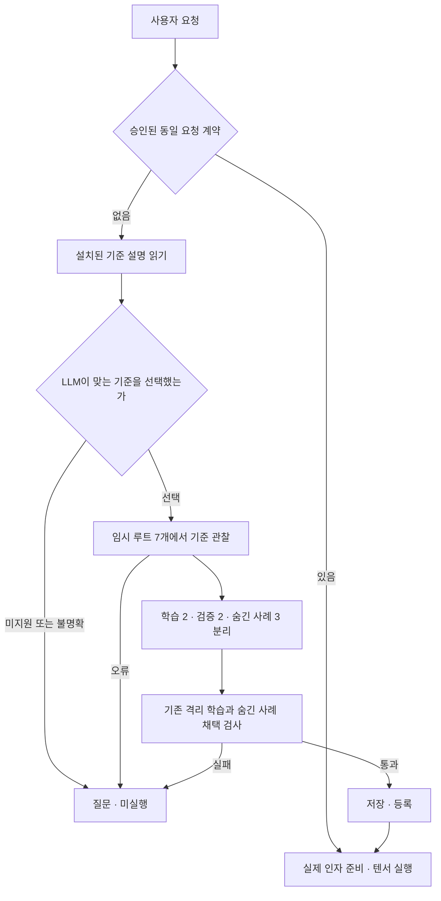

# 외부 기준에서 학습 근거 자동 수집

2026-10-05. 호출자가 설치한 외부 기준 목록에서 모델이 적합한 기준 ID를 선택하고,
백엔드가 임시 파일 상태를 준비해 실행 전후 전체 상태를 관찰하는 경로를 추가했다.
이제 이 범위에서는 사람이 요청마다 training/validation/heldout의 정답을 작성할 필요가 없다.



## 설치하는 기준과 발견하는 절차

ReferenceProviders는 작업 이름별 코드가 아니라 호출자 제공 데이터 manifest를 읽는다.
argv는 기존 외부 실행 파일과 파라미터 자리표시자로 구성한다. 예를 들어 cp 또는 mv의
실행 의미는 외부 리눅스 프로그램이 제공한다. 학습기가 받는 것은 실행 전후 상태와
관찰한 반환값이며, argv나 Python 작업 레시피를 텐서 실행기에 설치하지 않는다.
이 관찰로 파일 읽기/쓰기 또는 이동의 호출·인자 경로를 기존 학습기가 발견한다.
외부 바이너리 알고리즘을 텐서가 학습했다고 표현하지 않는다.

수집기는 다음을 공통 방식으로 처리한다.

| manifest 필드 | 의미 |
| --- | --- |
| id / description | 호출자 설치 ID와 의미 설명 |
| interface | parameters / output / allowed_operations |
| argv | 절대 실행 파일 경로와 문자열, $parameter 자리표시자 |
| seed_files | 상대 경로 또는 $parameter에 hex/$payload 데이터 배치 |
| directories | 초기 빈 디렉터리 경로 |
| return | success 또는 지정 파라미터 파일의 file_length 관찰 |
| max_steps | 1..12 호출 탐색 한도 |

v1은 path 입력 1~3개와 W-bit value 출력을 지원한다. 고정된 범용 payload 7개
(일반 문자열, NUL/비ASCII, 빈 값, 별도 문자열, 전체 바이트 범위, 한글, 8192바이트)를
서로 다른 초기 조건에 배치한다. 출력 목표는 실제 기준 실행 결과에서 얻는다.
기준의 성공은 반환 코드로 확인하고, 파일 길이는 실제 최종 파일 내용에서 관찰한다.
반환 관찰 규칙과 인터페이스는 호출자가 정한 의미이며 자동 발견한 것이 아니다.

실행 파일과 manifest의 SHA-256을 출처에 기록하고 수집 시작 때 실행 파일 변경을
거절한다. 실행은 shell 없이 기존 process_host의 시간/출력/프로세스 정리 기능을 쓴다.
기준당 7회, 실행당 2초, 출력 버퍼 65536, 파일 상태 65536바이트/파일·디렉터리 각 32개다.
상태에 symlink나 특수 파일이 있으면 거절한다. 모든 임시 루트는 종료 시 정리한다.

## 모델·학습·실제 실행의 경계

모델은 collect_evidence에 provider_id만 전달할 수 있다. 실행 명령, 실제 경로, 정답,
관찰 결과를 도구 인자로 바꿀 수 없다. 수집에는 실제 사용자 파일이나 실제 요청 인자를
전달하지 않는다. 전체 관찰을 검증한 다음 EvidenceBank로 전달하며 모델에는 ID/설명/
인터페이스/출처만 반환한다. 이후 기존의 숨긴 사례 검사와 원자적 저장을 사용한다.

한 요청에서 수집 시도는 한 번이다. 실패하면 학습·재수집 도구를 제공하지 않고 질문한다.
학습 후보 탐색에서는 기준 프로그램을 호출하지 않는다. 알려진 계약의 실행과 LLM 없는
직접 호출도 기준을 다시 실행하지 않는다. --no-learning에서는 수집 도구도 제공하지 않는다.

임시 루트는 테스트 파일의 분리이며 임의 실행 파일에 대한 OS 샌드박스가 아니다.
외부 기준은 호출자가 신뢰해서 설치해야 한다. LLM이 골랐다는 이유만으로 의미가 맞다고
인증하지 않는다. intent_independently_verified는 false이며, 잘못된 기준 선택이나 의도
해석을 상태 사례 통과만으로 알아낼 수 없다. 등록된 기준 밖의 새 목표는 근거가 부족하다.

## 사용과 재현

Python에서는 AgentSession(..., reference_providers=ReferenceProviders(manifests))를 쓴다.
CLI는 --reference-providers FILE을 받는다. 기존 --acquisition-evidence와 함께 쓸 수도
있고, 이미 해당 요청의 근거나 승인 계약이 있으면 수집 단계를 건너뛴다.
카탈로그 --encoder 모드와는 별도 모드다.

기존 vectorpro-test 하나에서 실행하며 결과 경로는 새 이름이어야 한다.

```powershell
nerdctl exec -e OMP_NUM_THREADS=1 -e MKL_NUM_THREADS=1 vectorpro-test python -m pytest -q tests/test_reference_evidence.py tests/test_verified_acquisition.py tests/test_agent.py
nerdctl exec -e OMP_NUM_THREADS=1 -e MKL_NUM_THREADS=1 vectorpro-test python -m experiments.reference_acquisition --output results/reference_acquisition_recheck
nerdctl exec -e OMP_NUM_THREADS=1 -e MKL_NUM_THREADS=1 vectorpro-test python -m experiments.reference_acquisition --live-gemma --output results/reference_acquisition_gemma_recheck
nerdctl exec -e OMP_NUM_THREADS=1 -e MKL_NUM_THREADS=1 vectorpro-test python -m pytest -q
```

수집 명세는 results/reference_acquisition/providers.json, 관찰은 copy-evidence.json과
move-evidence.json, 채택·실제 실행 결과는 summary.json, 누적 텐서는 program.pt에 있다.
프로토콜 실험은 스크립트 모델이며 실제 모델 정확도를 의미하지 않는다. 실제 Gemma
실험은 별도 reference_acquisition_gemma의 cases/providers를 추론 전에 고정했다.
모델에 기대 출력이나 평가 목표 상태를 주지 않았다. 최초 결과와 후속 재시험은 구분한다.

관련 28개 테스트는 성공/실패 수집, 임시 루트 정리, 실제 파일 보존, 학습 중 Popen
금지, 저장·재로드·기준 재실행 없는 재사용, 경로 이탈/코드 주입/잘못된 타입/변경된
실행 파일과 symlink/상태 크기 거절을 확인했다. 모델과 전체 회귀 결과는 HANDOFF.md에 기록한다.

실제 Gemma 3 1B Q8_0 첫 평가는 **3/3**을 통과했다. 영어 복사·이동 요청에서 각각
맞는 기준 선택→자동 수집→숨긴 3개 사례 채택→실제 실행을 완료했다. 암호화 요청은
조회/질문만 수행하고 기준 수집·학습·파일 변경을 하지 않았다. 모델 호출은 각각
3/3/2회였다. 이 세 사례에 한정된 성공이며 기준 선택의 범용 정확성은 아니다.
최종 전체 회귀는 **319 passed, 403.55초**였다.

## 현재 위치와 남은 과제

설치된 기준 범위에서 목표 예제 수집을 자동화하고, 학습·채택·실행으로 연결했다.
사람이 정답을 매번 작성하는 부담은 줄었지만 기준 프로그램/인터페이스/관찰 규칙의
설치는 여전히 필요하다. 임의의 목표에서 독립 정답을 자동 발견하는 범용 방법은 아니다.

다음은 다양한 새 목표의 기준 선택과 실제 인자 배정의 독립 평가, 상태·프로세스·HTTP
관찰 수집기의 확장, 표현이 달라진 요청의 검증된 재사용, 더 긴 작업·실패 복구·OS 검증이다.
