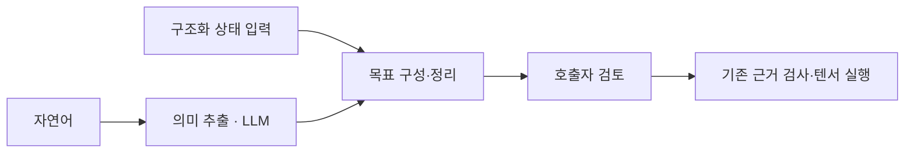

# 간결한 의미 추출과 내부 목표 구성

2026-10-05. 요청 해석의 조건 누락·잘못된 지원 판단·표현 차이를 줄이기 위해
상태 입력과 목표 구성을 분리했다. 자동 자연어 정확도 개선은 최종 평가에서
입증되지 않아 기존 기본값을 유지하고 새 방식은 명시적인 선택 경로로 제공한다.



## 구현한 것

`propose_goal(..., encoding="compact")`는 공통 path 인터페이스의 각 인자에
최종 상태를 작성하게 한다. `unchanged/absent/present/unspecified/initial:다른인자`
상태, 추가 효과 코드와 불명확한 요구를 반환하며 실행 순서·계약 ID·승인은 받지 않는다.
모델이 의미를 작성하므로 근거 없는 의미 인증은 아니다. 원본 유지의 중복 표기
`initial:자기자신`은 모델 schema에서 제외한다. 명확한 전체 보존은 모든 인자 unchanged다.

백엔드는 상태를 기존 목표 조건으로 바꾸고 변경 대상 외 전체 파일/디렉터리 보존
조건을 자동 구성한다. 함수 `goal_from_states(intent, names, states)`는 같은 구조화
입력을 LLM 없이 처리한다. 등록할 계약이 있는지는 이 해석 단계에서 판단하지 않는다.
명확하지만 없는 기능과 표현할 수 없는 목표를 같다고 주장하지 않는다. 압축·변환·
조건부 효과 등 코드가 있으면 `goal_outside_representation`, 불명확한 요구가 있으면
`goal_needs_clarification`으로 질문을 반환한다. 모델이 효과나 모순을 누락하는 오류는 남는다.

`normalize_goal`은 순서·중복과 unchanged 조건에 중복된 frame 예외를 정리한다.
`equals_initial:self`와 unchanged는 폴더와 없는 경로에서 의미가 다르므로 live 목표에서
자동 치환하지 않는다. 실험의 정규화 비교에서만 초기에 해당 인자가 일반 파일이라는
명시적 가정 `file_parameters`를 사용했다. 보편적인 논리적 동등성 판정기가 아니다.
원래 저장 파일의 목표/승인 해시를 일괄 바꾸거나 과거 연결을 재승인하지 않는다.

초안은 목표 해시와 한국어 검토 내용을 반환하며 기존 `accept_goal` 경계를 유지한다.
관찰·학습·등록·실제 사용자 파일 실행은 초안 작성 중 수행하지 않는다.
CLI에 `--goal-encoding compact`를 추가했다. API/CLI 기본값은 기존 rules로 유지했다.
goal memory 사용 시 기존 검색 경로를 유지한다. 기존 states/per_parameter 방식도 호환된다.

실제 Ollama의 Chat Completions 경로는 의미가 맞는 JSON을 본문에 반환하면서 도구
envelope를 생략하기도 했다. 새 경로는 본문 전체가 정확한 목표 데이터 JSON이거나
그 JSON 하나만 들어 있는 json 코드블록일 때 같은 schema 검증을 적용한다.
일반 문장 속 JSON 추출, 실행 명령, 다른 도구 호출, 자기 승인은 허용하지 않는다.
reasoning 본문은 읽어 명령으로 사용하지 않는다. 이는 초안 데이터 처리이며 실행 도구가 아니다.

## 실제 Gemma 비교와 실패 기록

기존 Docker `vectorpro-strong-test` 하나와 설치된 Ollama `gemma4:12b`만 사용했다.
새 이미지/컨테이너/모델 다운로드는 없다. 전체 회귀에 필요한 transformers4.57.6은
동일 컨테이너에 추가했다. torch2.14.1+cpu, Python3.13.5, numpy2.5.3을 유지했다.
모델 digest와 옵션은 직전 [STRONG_GOAL_MODEL.md](STRONG_GOAL_MODEL.md)와 같다.
구조화 비교는 temperature0/seed0/num_predict600/num_ctx8192/think=false,
Ollama schema format을 사용했다. native Chat Completions CLI smoke는 별도 전송 경로다.

기존 분류 우선 compact를 기준으로 사용했다. 각 사례의 정답은 추론 전에 파일로
고정하고 모델에 보내지 않았다. 조건 배열 엄격 일치와 명시된 일반 파일 입력 영역의
정규화 일치를 따로 기록했다. 정답 조건은 계획/경로 선택에 사용하지 않는다.
모델 목표로 가상 환경에서 계약 연결을 선택하고 실험 폴더에 실행한 뒤 정답으로
전체 파일/빈 폴더 상태를 채점했다. 오류 목표의 실제 실행도 실험 폴더에만 국한했다.
실험은 정답을 알고 있는 스크립트 평가이며 실제 인간 승인으로 해석하지 않는다.

| 버전·사례 | 기존 방식 정규화 일치 | 새 방식 정규화 일치 | 새 방식 오답 초안 |
|---|---:|---:|---:|
| v1, 기존 지원12건 중 중단 시점 | 비교용 전체16건 15/16 | 6/12 | 0 |
| v2, 기존16건 재시험 | 15/16 | 13/16 | 3 |
| v2, 새16건 | 15/16 | 13/16 | 3 |
| v3, 별도 새16건 | 16/16 | 15/16 | 1 |

v1은 복사 자체를 추가 효과로 서술해 보류하는 문제가 확인돼 지원12건까지의 결과를
보존하고 중단했다. 28개 완료 응답만 보존되며 16개 완결 평가처럼 계산하지 않는다.
중단 당시 진행 중이던 호출은 완료 응답/비용에 포함하지 않는다.

v2는 효과 코드를 제한했지만 지시와 선택지가 많았고, 이동을 복사/존재로 약화하거나
모순·모호한 요구를 정상 목표로 만들었다. 새 평가의 모델 목표 native 실행은24/30으로
일부 실행 성공도 잘못된 원문 의미를 입증하지 못했다. 기본값으로 채택하지 않았다.

v3는 지시를 줄이고 인자별 schema에서 자기 바이트 복사 표기를 제거했다.
수정 뒤 별도 새16건을 고정해 평가했다. 지원12/12가 맞았지만 source가 사라져야
하면서 그대로 남아야 한다는 모순1건을 정상 목표로 만들었다. 미지원/모순/모호4건 중
3건을 보류했고 기존 방식은4건 모두 보류했다. 새로운 오답이 남아 기본값을 유지했다.
원시 결과는 results/semantic_goal_comparison_v3에 있다.

v3 지원 복사/이동8요청×3입력의 실제 리눅스 상태는 **24/24**였다. 잘못 제안한
모순 요청의 실험 실행3건은 모두 실패해 전체 모델 목표 실행은 **24/27**이다.
보존/삭제는 목표를 맞췄지만 이번 저장 파일에 계약이 없어 실행하지 않았다.
이전 단계나 다른 버전의 재시험을 독립 사례로 합산하지 않는다.
새 요청은 실험 작성자의 작은 영어/한국어 표본이며 더 넓은 의도 정확도를 보장하지 않는다.

원본 프로그램 SHA-256은 `277964b962ab167e840b9f8f21544577696d14548ecf8b3da203d80582438f2c`
이며 바이트를 유지했다. 작업 절차를 Python에 추가하지 않았고 실행 커널/학습기/
저장 형식/기존 프로그램을 변경하지 않았다. 내부 복합 계획기 구현은 이번 범위 밖이다.

완료 응답의 벽시계 합: v1 201.19초(28회), v2 467.36초(64회), v3 253.05초(32회).
총921.60초와124회이며 중단 호출/pytest/CLI smoke 시간은 제외한다.
동일 사례 재시험과 캐시·회귀 병행 영향이 있어 모델 속도나 독립 정확도를 합산하지 않는다.
각 호출의 전체 prompt/schema/응답/시간/토큰과 결과는 각 폴더의 raw_calls/summary/metrics.json에 있다.
중간 두 버전의 prompt/schema는 원시 호출에 보존하며 아래 명령은 최종 v3 코드 재현이다.

## 사용과 재현

```python
from vectorpro.goal_interpretation import goal_from_states
goal = goal_from_states("caller request", ["source", "destination"],
                        {"source": "unchanged", "destination": "initial:source"})
# Caller-owned structured goal: pass it through the existing request_goal path.
```

```sh
docker exec -e PYTHONPATH=/workspace/src -e OMP_NUM_THREADS=1 -e MKL_NUM_THREADS=1 vectorpro-strong-test python -m experiments.semantic_goal_comparison --final-unseen --output results/semantic_goal_recheck
docker exec -e PYTHONPATH=/workspace/src -e OMP_NUM_THREADS=1 -e MKL_NUM_THREADS=1 vectorpro-strong-test python -m pytest -q
docker exec -e PYTHONPATH=/workspace/src vectorpro-strong-test python -m vectorpro.agent --program results/goal_router_execution_replay/program.pt --endpoint http://host.docker.internal:11434/v1/chat/completions --model gemma4:12b --intent 'source is retained; destination must contain the original source bytes.' --draft-goal --goal-encoding compact --reference-providers results/semantic_goal_cli_v2/providers.json
```

재현 출력 경로는 기존 기록을 덮어쓰지 않는 이름을 쓴다. CLI 초안의 종료 코드2는
작업 실행 성공이 아니다. 구조화 데이터 검증·승인 해시·전체 상태 보존·JSON 본문
검증은 pytest에서 확인한다. 최종 회귀/실제 CLI smoke 결과는 HANDOFF.md에 기록한다.

현재 단계는 내부 목표 구성과 선택적 해석 연결의 구현·검증이다. 자연어 의미 오류를
해결했다고 주장하지 않는다. 남은 과제는 모순 요구를 빠뜨리지 않는 해석과 호출자
확인, 실제 경로/역할 연결, 더 넓은 목표·독립 요청 평가, 목표 기반 내부 계획기다.
