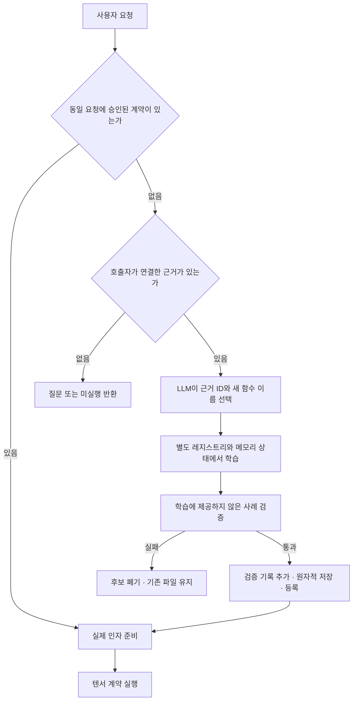

# 호출자 근거에 기반한 요청 학습과 재사용

2026-10-05. 선택적인 EvidenceBank 어댑터를 추가했다. 흐름은 다음과 같다.



## 근거와 LLM의 구분

EvidenceBank는 호출자가 생성자 또는 CLI 파일로 제공한다. LLM은 근거를 추가하거나
정답을 바꾸는 도구를 받지 않는다. 인터페이스의 타입·역할·출력·허용 실행 기능은
근거에 포함한다. LLM은 근거 ID와 새 함수 이름을 선택하고, 백엔드가 그 인터페이스로
데이터 전용 계약 초안을 만든다. 실제 호출 순서·인자 연결은 기존 학습기가 탐색한다.
작업 이름에 따른 Python 실행 레시피를 추가하지 않았다.

모델에는 인터페이스와 근거 ID/출처만 전달한다. 학습·검증·숨긴 사례의 입력과 정답은
모델 문맥에 넣지 않는다. 학습기는 training/validation만 받는다. heldout은 후보를
찾은 다음 별도로 검사하며 학습에 반환하지 않는다. 실패 사례의 정답도 모델에 노출하지
않고 후보를 폐기한다. 학습 실패는 해당 요청을 종료한다.

origin은 호출자의 출처 설명이며 인증서가 아니다. 실제로 독립된 출처인지는 호출자가
책임지고 제공해야 한다. 잘못된 출처나 잘못된 목표를 이 구조가 스스로 알아내는 것은
아니다. 결과의 intent_independently_verified는 계속 false다.

## 입력 형식

근거 파일은 레코드 배열이다. 레코드는 다음 필드만 받는다.

| 필드 | 의미 |
| --- | --- |
| id / intent / origin | 고유 ID, 정확한 원래 요청 문자열, 호출자가 선언한 출처 |
| interface | parameters / output / allowed_operations |
| lesson 또는 state_lesson | 기존 숫자 또는 상태 학습 형식 중 하나 |
| heldout | 숫자 예제 집합 또는 상태 사례 배열 |

기존 사례 수·바이트·타입·시간 제한을 적용한다. 근거는 최대 32개, 레코드당 JSON
1MiB다. 입력은 복사해 보관하고 반환 메타데이터도 복사한다. 상태 반환값을 포함한
모든 사례의 목표가 명시되어야 한다. heldout은 training과 validation 모두와 입력/
초기 상태 기준으로 분리한다. 상태 확인은 새 MemoryHostContext에서 전체 파일·
디렉터리·반환값과 외부 관찰 기록 소비를 검사한다. 숫자는 별도 폭에서도 검사할 수 있다.

## 등록과 실행 경계

후보는 별도 레지스트리에서 학습한다. 숨긴 사례 통과 뒤 acceptance 기록에 전체 근거
SHA-256, 요청 SHA-256, 출처와 검사 수를 넣는다. 프로그램 저장까지 성공한 뒤 살아 있는
레지스트리를 교체한다. 학습/검증/저장 실패는 기존 프로그램·레지스트리·런타임 RNG를
유지한다. 이 SHA는 재현용 무결성 기록이며 외부 출처 인증 서명은 아니다.

검증 모드에서는 현재 요청의 정확한 문자열과 acceptance가 일치하는 계약만 제공한다.
같은 ID의 근거를 다시 공급하면 해시도 일치해야 한다. 다른 목표에서 기존 계약으로
대체 실행하는 것을 막는다. 저장된 승인 기능은 원래 근거 파일 없이 같은 요청에서
재사용할 수 있다. 요청의 표현이 달라지면 재승인이 필요하다. 자연어 의미 동등성을
자동 판정하지 않는다. 기존 카탈로그/기본 어댑터는 별도로 유지한다.

완전한 호출자 근거가 연결되고 승인 계약이 없으면 학습 도구만 제공한다. 승인 계약이
하나이고 모든 인자가 path이며 원문 경로 리터럴 수가 인자 수와 같으면 호출 도구만
제공한다. 그 밖에는 질문/조회 경로를 유지한다. 역할에 따른 경로 배정은 모델이 하며,
원문 밖 경로는 스키마와 백엔드가 거절한다. 이 제한은 범용 의도 이해 증명이 아니다.

배운 절차는 call_contract로 LLM 없이 바로 실행할 수 있다. 어댑터가 실행하더라도
executed 결과에서 대화를 끝내며 중복 실행이나 모델의 성공 문장으로 대체하지 않는다.
등록은 실제 파일 작업 완료와 다르다. 실제 작업 실패 때 외부 상태를 자동 롤백하지 않는다.

## 검증과 재현

기존 vectorpro-test 하나에서 실행한다. 실험 결과 경로는 새 이름이어야 한다.

```powershell
nerdctl exec -e OMP_NUM_THREADS=1 -e MKL_NUM_THREADS=1 vectorpro-test python -m pytest -q tests/test_verified_acquisition.py tests/test_agent.py tests/test_contract_learning.py
nerdctl exec -e OMP_NUM_THREADS=1 -e MKL_NUM_THREADS=1 vectorpro-test python -m experiments.verified_acquisition --output results/verified_acquisition_recheck
nerdctl exec -e OMP_NUM_THREADS=1 -e MKL_NUM_THREADS=1 vectorpro-test python -m experiments.verified_acquisition_gemma --output results/verified_acquisition_gemma_recheck --run-kind replay
nerdctl exec -e OMP_NUM_THREADS=1 -e MKL_NUM_THREADS=1 vectorpro-test python -m pytest -q
```

CLI는 --acquisition-evidence FILE 옵션으로 호출자 근거를 받는다. --encoder 카탈로그
모드와 동시에 사용하지 않는다. --no-learning에서도 승인된 계약은 실행할 수 있다.

통합 실험은 임시 디렉터리의 실제 /bin/cp 결과에서 학습 2건·검증 2건·숨긴 3건을
고정한 다음 어댑터를 시작했다. 최종 프로토콜 증거는 results/verified_acquisition_final.
실제 새 입력 복사, 저장 후 LLM 없는 재사용, 학습 비활성 상태의 알려진 요청 호출을
통과했다. 이 실험의 ProtocolModel은 도구 프로토콜용 스크립트이며 실제 LLM 평가가 아니다.
학습 중 Popen을 금지하는 테스트와 숨긴 목표 불일치, 중복 사례, 입력 변경, 저장 오류,
다른 요청/변경된 근거의 재사용 거절 및 숫자 숨긴 사례 성공/실패도 검사한다.

Gemma의 최초 결과와 수정 후 동일 요청 재시험은 별개다. 최초 시험은 1/3:
학습 초안의 함수 이름을 한글 요청으로 작성해 거절됐고, 이후 알려진 요청 시험도 학습이
완료되지 않아 실행되지 않았다. 근거 없는 요청은 파일을 보존했다. 이름 규칙과 간결한
입력·단계별 도구를 보완한 후 재시험했다. 최종 결과는 HANDOFF.md에 기록한다.
중간 replay의 긴 설명 길이 제한은 llama.cpp 문법 생성 오류/종료139를 일으켰으며
최종 스키마는 이름 규칙만 문법으로 제한하고 상세 길이 검사는 백엔드에 둔다.

최종 results/verified_acquisition_gemma_phased_final 재시험은 **3/3**을 통과했다.
새 기능 요청은 학습/숨긴 3개 사례/저장/실제 실행을 완료했고, 같은 요청의 다음
실행은 재학습 없이 수행했다. 근거 없는 다른 요청은 질문하고 모든 파일을 보존했다.
모델 호출은 각각 2/1/2회다. 저장 후 LLM 없는 실행은 별도 프로토콜 실험에서 확인했다.
최초 실패를 본 뒤 같은 요청을 개선·재시험한 결과로, 새 요청의 독립 정확도는 아니다.

## 현재 위치와 남은 과제

호출자가 선택한 독립 근거를 모델과 분리하여 학습·채택·저장·실행으로 연결하는 초기
경로를 구현했다. 모든 정답을 LLM이 만들어야 하는 구조에서 벗어났지만, 인간의 의도를
해석해 적절한 독립 출처를 자동으로 찾는 문제까지 해결하지 않았다.

다음은 다양한 새 목표의 근거 수집기/검증기를 연결하고, 실제 인자 배정과 자연어 표현
변화의 정확성을 독립 평가하며, 더 긴 작업·복구·권한/링크·인터넷/TLS와 OS 검증을
확장하는 것이다. 유한 사례 통과와 프로그래밍 언어 전체 대체를 구분한다.
