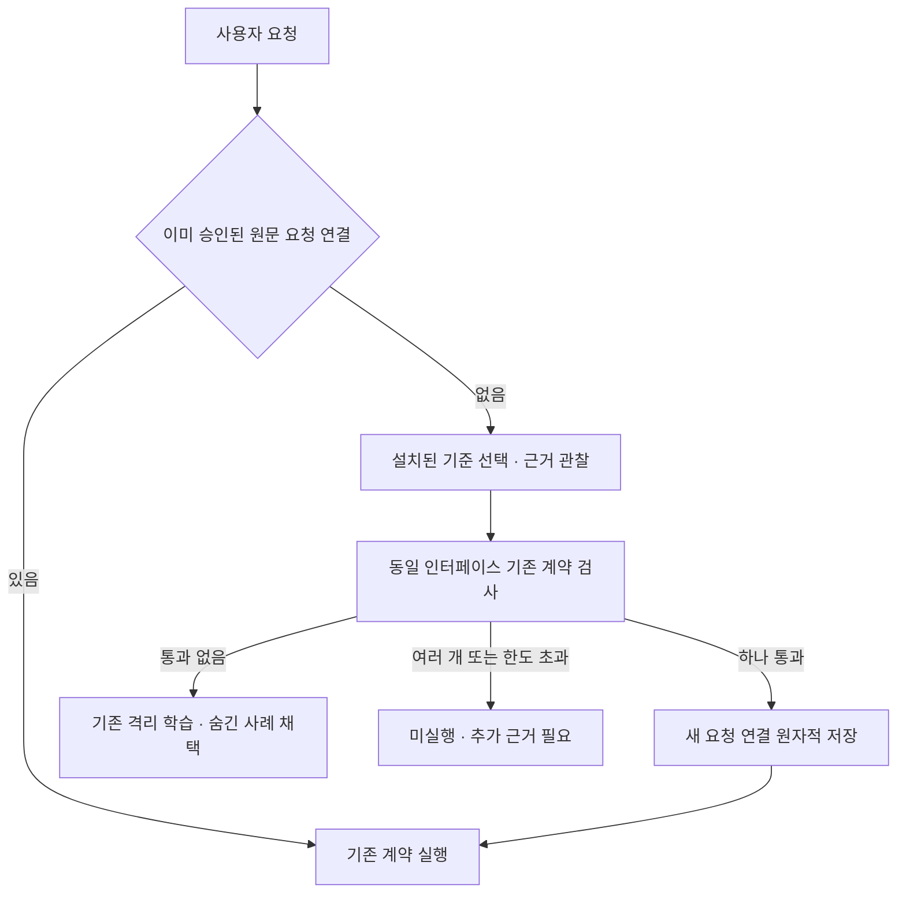

# 다른 표현의 요청을 검증해 기존 계약 재사용

2026-10-05. 기준 관찰 뒤 새 기능을 학습하기 전에 기존 계약을 검사한다.
새 요청의 근거를 통과하는 계약이 하나면 그 계약을 재사용하고, 요청 연결만 저장한다.
함수 구현·기존 계약 ID·레지스트리·런타임 학습 RNG는 변경하지 않는다.



## 재사용 판단

EvidenceBank.reuse는 이름이나 자연어 유사도가 아닌 실제 실행 결과를 비교한다.
입력 이름·타입·역할, 출력 타입·폭이 같은 계약을 대상으로 하고, 현재 근거의 허용
호스트 기능 밖의 동작을 사용하는 계약은 제외한다. 후보는 최대 32개, 기본 검사
시간은 10초이며 최대 설정은 60초다. 시간은 후보/사례 사이에 확인하고 개별 실행의
기존 커널 한도를 유지한다. 실행 중인 호출을 총시간 기준으로 선점하지 않는다.

상태 계약은 새 MemoryHostContext에서 training/validation/heldout을 모두 검사한다.
전체 파일·빈 디렉터리·반환값과 관찰 기록의 정확한 소비를 기존 평가기로 비교한다.
숫자 계약은 세 집합의 입력/출력과 폭을 검사한다. 학습기는 호출하지 않는다.
다른 작업의 부분 결과만 맞거나 반환값만 같아도 상태가 다르면 재사용하지 않는다.

맞는 계약이 없으면 기존 학습 경로로 간다. 여러 계약이 통과하면 이름이나 등록
순서로 하나를 고르지 않는다. 한도 초과도 재사용 승인이 아니다. 기준 선택과 원래
사용자 의도의 관계는 모델 선언이며 intent_independently_verified는 계속 false다.

## 요청 연결 저장

프로그램의 선택적 intent_bindings에 다음 데이터를 저장한다.

| 필드 | 의미 |
| --- | --- |
| contract_id | 기존 구현을 가리키는 변경되지 않은 계약 ID |
| intent_sha256 | 검증한 새 요청 원문 해시 |
| source_id / source_sha256 | 현재 독립 근거의 ID와 내용 해시 |
| checked_cases | 통과한 전체 사례 수 |

최대 256개이며 중복/잘못된 SHA/존재하지 않는 계약/제공 호스트 함수 연결을 거절한다.
저장은 기존 원자적 파일 교체를 사용하고 저장 성공 뒤 메모리 연결을 채택한다.
저장 실패는 기존 파일/레지스트리/연결/RNG를 유지한다. .pt에서는 이 메타데이터도
같은 파일의 텐서 인코딩에 포함되며 별도 JSON 실행 색인을 필요로 하지 않는다.
.json도 지원하며 저장 버전은 1을 유지한다. 기존 파일은 연결 없는 상태로 로드한다.

같은 원문 요청을 다시 받으면 저장된 연결로 계약을 제공한다. 원래 근거 없이도
재사용할 수 있으며 새로 공급한 같은 ID의 근거가 다르면 과거 연결은 승인하지 않는다.
바뀐 계약을 가리키는 저장 연결은 로드/저장에서 거절한다. 기존 계약 ID를 쓰는
프로그램 호출자는 연결과 관계없이 계속 call_contract를 LLM 없이 사용할 수 있다.

현재 자동 연결은 reference_providers의 collect_evidence 뒤 수행한다. 직접 제공된
EvidenceBank의 호출자는 reuse API를 사용할 수 있다. 임의 새 표현을 텍스트만 보고
승인하지 않으며, 아직 검사하지 않은 표현은 기준 관찰을 다시 해야 한다.
출처 해시와 요청 해시는 재현용 기록이지 출처나 의도의 인증 서명이 아니다.

## 검증과 재현

기존 vectorpro-test 하나와 기존 Gemma만 사용한다. 결과 경로는 새 이름이어야 한다.

```powershell
nerdctl exec -e OMP_NUM_THREADS=1 -e MKL_NUM_THREADS=1 vectorpro-test python -m pytest -q tests/test_verified_reuse.py tests/test_reference_evidence.py tests/test_verified_acquisition.py tests/test_contract_learning.py
nerdctl exec -e OMP_NUM_THREADS=1 -e MKL_NUM_THREADS=1 vectorpro-test python -m experiments.verified_reuse --output results/verified_reuse_recheck
nerdctl exec -e OMP_NUM_THREADS=1 -e MKL_NUM_THREADS=1 vectorpro-test python -m experiments.verified_reuse --live-gemma --output results/verified_reuse_gemma_recheck
nerdctl exec -e OMP_NUM_THREADS=1 -e MKL_NUM_THREADS=1 vectorpro-test python -m pytest -q
```

관련 43개 테스트는 새 표현의 전체 사례 검사, .pt/.json 재로드, 학습 함수 호출 금지,
기존 ID/레지스트리/RNG 보존, 이동과 복사의 상태 차이, 숨긴 목표 불일치, 여러 후보,
저장 실패, 변경된 근거/계약 거절과 반복 요청의 기준 수집 금지를 확인했다.

프로토콜 실험은 이전 실험에서 배운 두 기능의 파일을 로드해 복사·이동의 새 표현과
복사 반복 요청 3건을 통과했다. 결과는 results/verified_reuse에 있다. 이 모델은
스크립트이며 실제 LLM 의도 정확도가 아니다. 실제 Gemma는 별도
results/verified_reuse_gemma에 추론 전 cases/providers/initial_contracts를 고정했다.
검사마다 기존 계약 전체와 레지스트리가 동일한지도 확인한다. 실제 결과와 전체 회귀
결과는 HANDOFF.md에 기록한다.

## 현재 위치와 남은 과제

실제 Gemma 첫 평가에서는 4건 중 복사/반복 2건만 성공했다. 이름 변경과 암호화에도
복사 기준을 선택했다. 기준 선택 문맥을 분리한 재시험에서도 이름 변경이 실패했다.
이 결과는 의도 해석의 보장이 없다는 실제 반례다. 실패 결과의 program.pt는
진단용이며 실행용으로 사용하면 안 된다. 자세한 결과는 HANDOFF.md를 참조한다.

관찰 가능한 근거가 있는 다른 표현의 요청을 기존 기능에 연결하고 중복 학습을
줄이는 단계다. 설치된 기준 선택의 범용 정확성이나 임의의 자연어 동등성 증명은 아니다.
재사용 검사의 고정된 사례를 통과했다고 전체 입력 공간에 대한 증명으로 표현하지 않는다.

남은 것은 더 다양한 목표의 독립 평가, 기준/상태·프로세스·HTTP 관찰 확장, 이름과
역할이 다른 인터페이스의 검증된 인자 변환, 긴 절차·실패 복구·추가 OS 검증이다.
